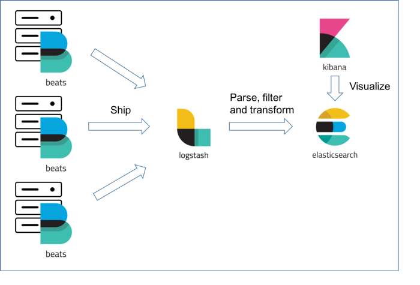
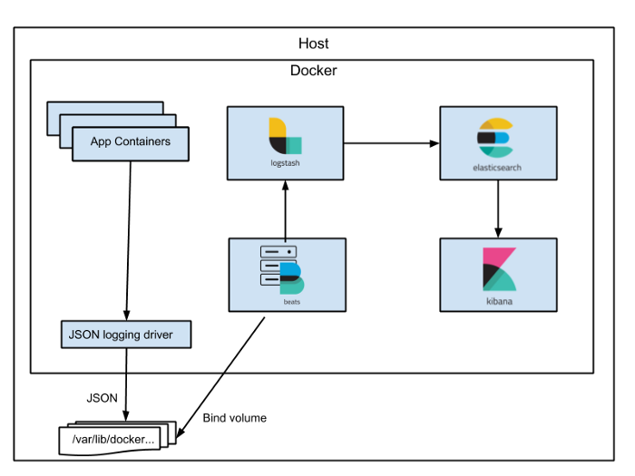

## Challenge Terraform ELK

### Sobre o Desafio

Como objetivo de demonstrar essas habilidades, vamos criar uma infraestrutura de monitoria. O seu objetivo será subir uma Elastic Stack (ELK) e conseguir agregar dados de log de uma EC2.

O que avaliaremos aqui:

- Uso de ferramenta de IaC (usamos Terraform e Packer)

- Conhecimento de cloud (usamos AWS)

- Domínios de boas práticas de infraestrutura e resiliência de sistemas

- Práticas de monitoria/observabilidade

- Organização do código


### Organizacao do Repositorio

Este repositorio está dividido entre tipos de recurso:
   * [containers](containers)
   * [packer](packer-aws-image)
   * [terraform-modules](terraform-aws-resources)

Cada recurso tem suas proprias dependencias e elas estao descritas em seus arquivos de readme.

### Sobre a Logica utilizada

Containers: 
  Em elk-containers está configurado o Logstash e o Filebeats que é a parte da tecnologia responsabel pelo envio e padronizacao dos logs para o elasticsearch.
  Em application-example está configurado um container ubuntu configurado com um loop mostrando as mensagens app:example e foo:bar, estas mensagens serao vistas no elasticsearch.
  
Packer-aws-image: 
  Irá buildar a aws_image que será utilizada nesse desafio, utilizei Ansible para bootstrap dessa instancia.
  
Terraform-modules:
  A definicao do codigo terraform responsavel por iniciar o domain elasticsearch na aws e um autoscaling-group utilizando a aws_image criada pelo Packer.
  

### Arquitetura ELK
* A Arquitetura padrao do ELK segue o fluxo abaixo: 



* Foi implementado a coleta e geração de logs baseados em container, seguindo o fluxo de arquitetura como o do exemplo abaixo:



### Inicio dos Testes(ainda manual).

Criei uma instancia, instalei o filebeat e o logstash e os configurei para enviar os primeiros logs para o elasticsearch.

* Para enviar os logs:
````bash
sudo /usr/share/filebeat/bin/filebeat -e -c /etc/filebeat/filebeat.yml
sudo /opt/logstash-7.1.1/bin/logstash -f /opt/logstash-7.1.1/config/test.conf
````